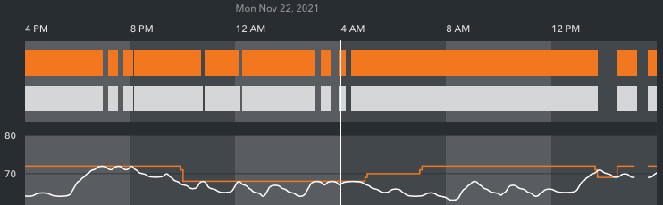
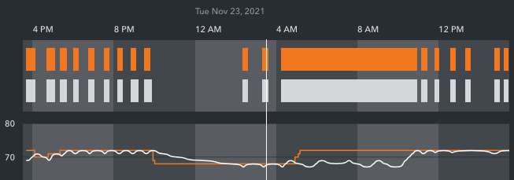
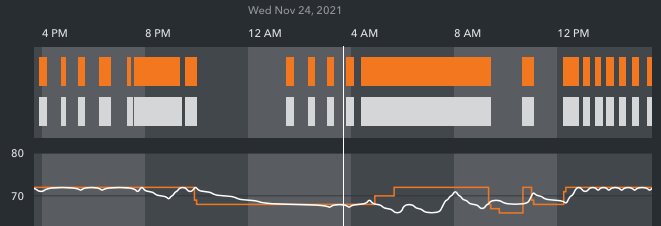
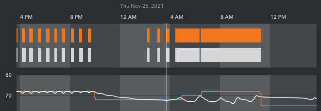
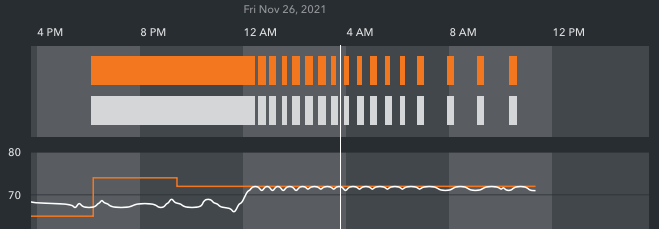

Sun-Mon: Here’s the 24 hours before you replaced the controller (the gap at the end was when you had the system off). The system wanted heat from 4AM Monday until about 1PM when it finally got to 70, just as I lowered the temp to 69.

Mon-Tue: Starts when you turned the system back on; tracked well until 5AM Tuesday (when the goal changed from 68 to 72); didn’t reach 72 until about 10:45AM - tracked well for the rest of the afternoon…

Tue-Wed: …and correctly dropped to 68 overnight, but didn’t climb to 72 at 5AM; we played with the goal a bit, and when we set it to 72 again just after noon, it reached it and again did well for the rest of the afternoon…

Wed-Thu: … and overnight, but didn’t climb to 70 (new daytime goal) at 5AM again, nor 72 (new manual setting) at about 6AM. Mom left about 10:30 and lowered the temp to 65 while she was away.

Thu-Fri: but when she raised the temp to 74 on her return at about 6PM, it again didn’t heat to the target. At about 9PM, I (remotely) changed the programming to hold 72 indefinitely; at about midnight this morning, it reached the target and seems to have held it since. Just talked to Mom, and she says it still feels cold, so I’ve just changed it to hold 74 indefinitely.

I’d really like her to be able to reduce the temperature at night and when she’s away, and to adjust the temperature without these long uncomfortable gaps, though. Sunday night I’ll set it back to be lower overnight; hopefully it’ll be misbehaving again when you return. Thank you!
